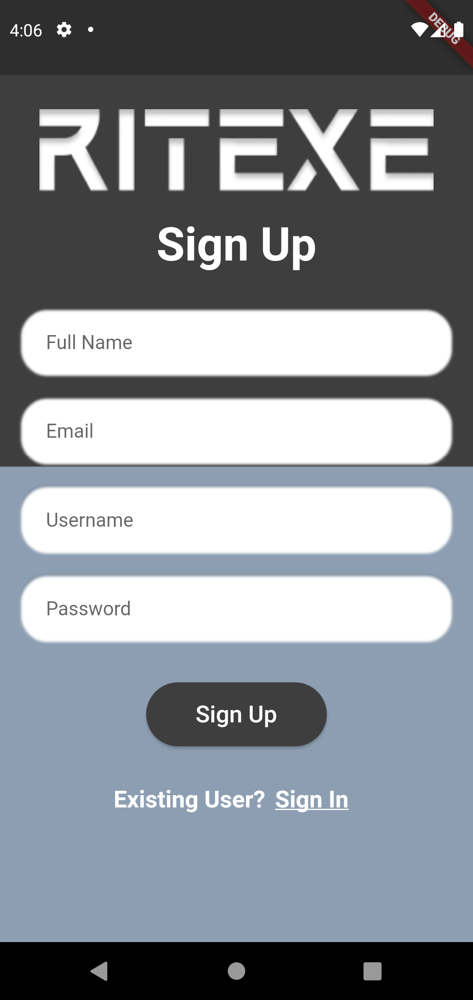
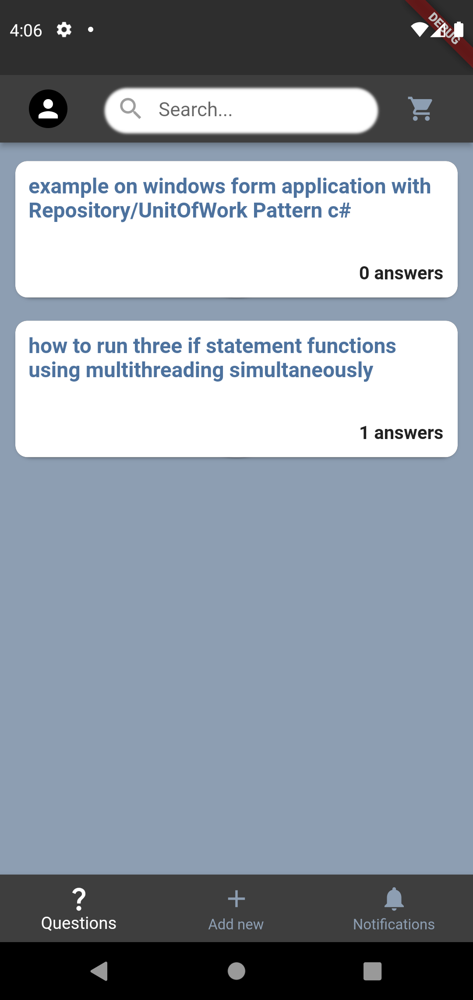
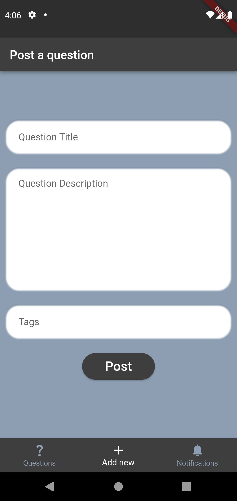
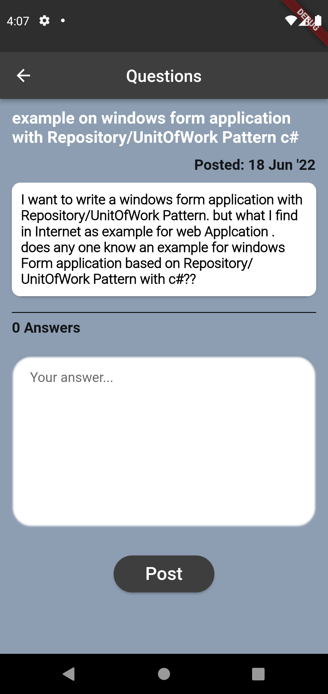
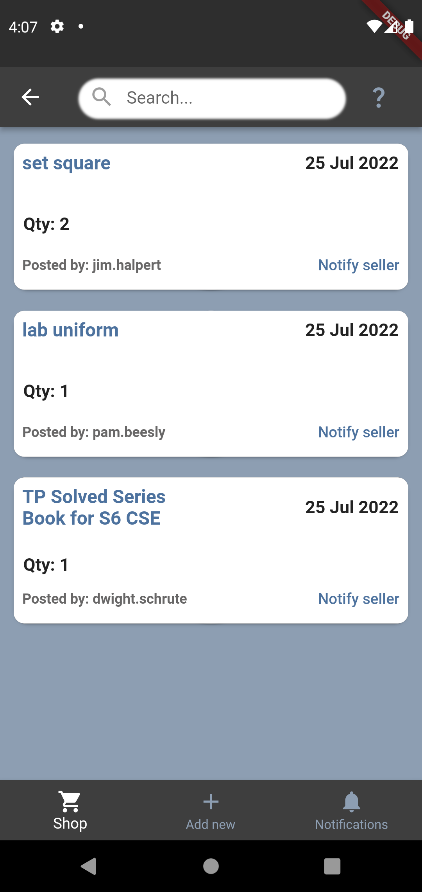

# Ritexe: A Discussion Forum for RIT.

A discussion forum which allows anyone from RIT to ask doubts and be part of various discussions or queries, done as a course miniproject.

## Technlogies Used
<ul>
<li><a href="https://flutter.dev/">Flutter</a></li>
<li><a href="https://fastapi.tiangolo.com/">FastAPI</a></li>
<li><a href="https://www.mysql.com/">MySQL</a></li>
</ul>

## Screenshots

## Screen Recording
https://user-images.githubusercontent.com/62176326/182294853-c99e5f0c-b936-4944-9be5-6c3d650b34e1.mp4
